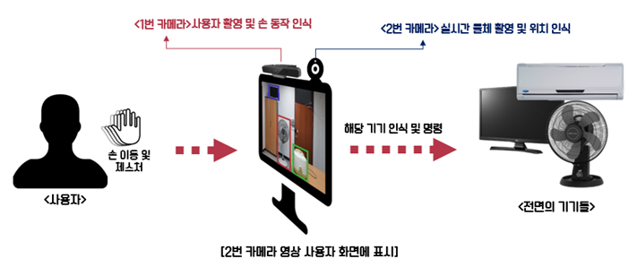
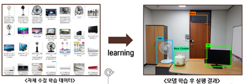
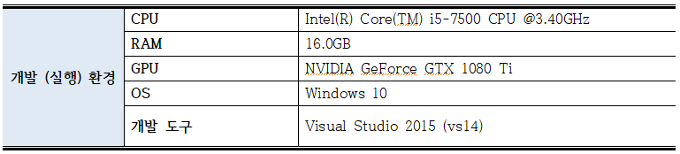

# Wearless IoT Device Controller based on Deep Neural Network and Hand Tracking

##### 딥 뉴럴 네트워크 및 손 추적 기반의 웨어리스 IoT 장치 컨트롤러

## 1. 프로젝트 설명 

### 카메라 두 개를 이용하여 hand gesture 만으로 화면에 보이는 IoT 기기들을 실시간 제어 할 수 있는 시스템 개발

 ##### 1번 카메라 (RGB-D 카메라) : 사용자의 손 동작 인식

 ##### 2번 카메라 (일반 Web-cam) : 사용자 전면에 있는 device들을 촬영

 - 전면의 모니터에는 2번 카메라로 촬영한 device들을 detection & recognition 한 영상 위에 사용자의 손의 위치를 표기한다. 

 - 선택하고자 하는 기기의 위치에서 특정 hand gesture를 이용하여 기기를 선택하고 제어한다. 

## 2. 구성

###### HandCursor/Handcursor/hand_client.cpp 

- 윈도우 소켓 통신을 이용하여 손의 위치 값과 제스쳐 정보를 전달

###### HandCursor/Handcursor/HandCursor.cpp

- RGB-D 카메라(RealSense)를 이용하여 손의 위치 값과 제스쳐 정보를 카메라로부터 받아옴 

###### ObjectDetection/yolo/build/Project1/소스.cpp 

- 2번 카메라에서 받아온 영상을 yolo 알고리즘을 이용해 object detection (자체 학습 모델 이용)

   \-  https://github.com/unsky/yolo-for-windows-v2

- handCursor 프로세스와 통신하여 제스쳐 값 수신 후 위치 값 보정 

- 제스쳐에 따라 각 장치와 통신 (소켓)

######  \* yolo (You Only Look Once) : 실시간 물체 탐지 Deep Learning 알고리즘 

- **매우 빠른 속도로 물체 탐지** 가 가능한 알고리즘으로 사용자 모니터에 실시간으로 탐지한 화면을 보여주기 위한 알고리즘으로서 채택 

  

- 자체적으로 수집한 device의 사진데이터(6종류, 약 2600개)를 30,000회 학습 
- 30fps 이상의 frame rate로 80% 이상의 정확도로 사물 인식

## 3. 개발환경

